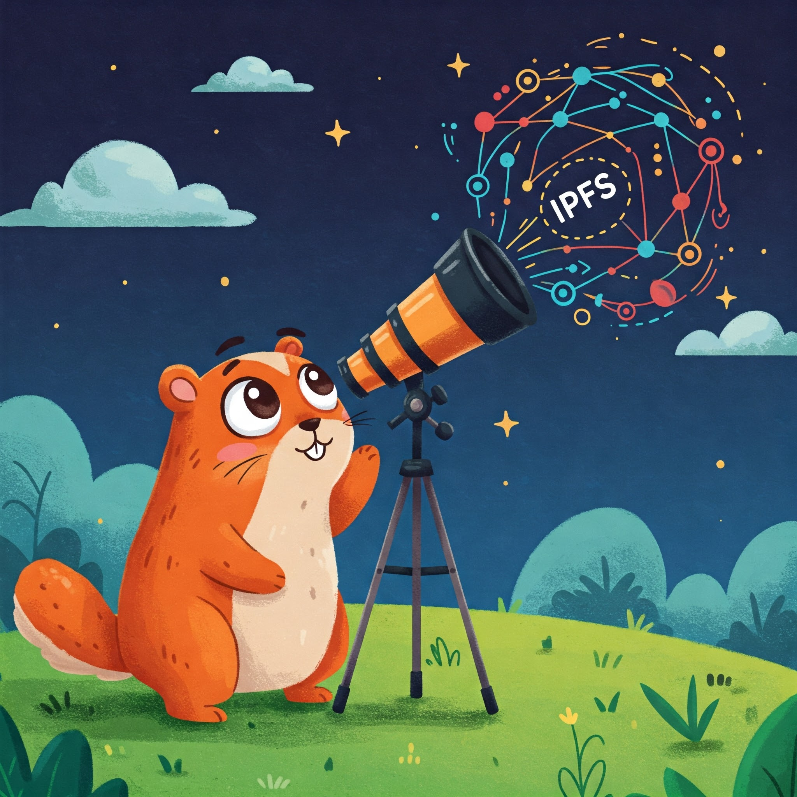
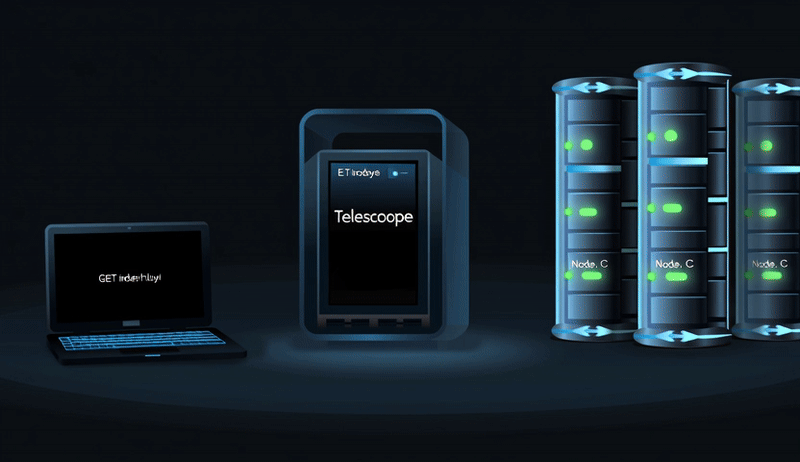
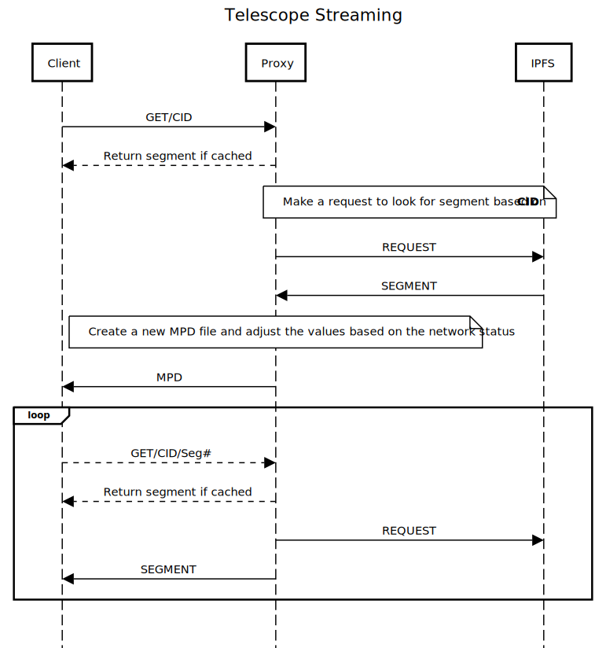

<p align="center">
   
</p>

<div align="center">

   
   
   
   

   
   
   
   
   

</div>

**Telescope** is a smart adaptive bitrate (ABR) proxy system designed for streaming content over the InterPlanetary File System (IPFS). It dynamically adjusts video quality based on network conditions and cache awareness, enhancing the efficiency and user experience of decentralized video delivery.

This version of Telescope is an enhanced iteration of the [NetSys Lab's Telescope](https://github.com/SBUNetSys/Telescope) project. We have rebuilt the system, replacing all emulations and simulations with real-world applications and methodologies. The ultimate objective is to deliver a stateless, scalable, and high-performance smart adaptive bitrate proxy that leverages IPFS as its storage layer.

## 🚀 Features

- **Dynamic ABR Logic**: Rewrites DASH MPDs in real-time using IPFS, Gateway, and Client bandwidth estimations.
- **Cache Awareness**: Tracks segment caching status to optimize quality selection.
- **Statistical Bandwidth Estimation**: Dynamically adjusts bandwidth predictions by incorporating probabilistic models for replica selection, ensuring more accurate quality adaptation in multi-replica environments.
- **Stateless Microservices**: Replaces stateful proxy servers with scalable, stateless services.
- **Modern Observability**: Real-time metrics with Prometheus and distributed tracing with OpenTelemetry (Jaeger).
- **DASH.js Integration**: Fully compatible with DASH.js for live testing of streaming behavior.
- **Improved Architecture**: Clean, modular project structure with faster service using Go-Fiber.
- **Scalable Proxy System**: Designed to handle high traffic and large-scale deployments.

## 🆕 What’s New in This Version?

- Migration from **Gin** to **Go-Fiber** for improved performance.
- Redesigned ABR logic aligned with formal analysis and research papers.
- Enhanced observability with **Prometheus metrics** and **OpenTelemetry tracing**.
- File-based segment **cache tracking system** for better cache management.
- Support for **stateless microservices** to improve scalability and reliability.

## 📖 How Telescope Works



Telescope acts as a smart proxy between a DASH video player and IPFS. It intercepts video segment requests, estimates network conditions and caching status, and dynamically rewrites the video manifest (MPD) to guide adaptive quality selection.

### Workflow

1. **Manifest Request**:
   - The DASH.js player requests the `.mpd` manifest from Telescope.
   - Telescope fetches the segment CID list from IPFS and rewrites the MPD based on bandwidth estimations (`Tc` as client estimation, `Tg` as gateway bandwidth, `Tn` as IPFS bandwidth).
   - The rewritten MPD is returned to the player.

2. **Segment Request**:
   - The player requests video segments from Telescope.
   - Telescope fetches the segment from IPFS (or serves it from the cache if available).
   - The segment is streamed back to the player.
   - Telescope updates `Tg` and `Tn` for next requests.

### Sequence Diagram

```plaintext
Client->>Proxy: GET /videos/bunny.mpd
Proxy->>IPFS: Fetch segment CID list
Proxy->>Proxy: Rewrites MPD based on Tc, Tg, Tn
Proxy-->>Client: Returns adaptive MPD

Client->>Proxy: GET /videos/bunny_128256bps/seg1.m4s
Proxy->>IPFS: Fetch segment or serve cached
Proxy-->>Client: Stream segment
```

#### Sequence Diagram



#### Old Architecture


### New Architecture


## 📊 Metrics and Observability

Telescope provides real-time metrics and distributed tracing to support debugging, monitoring, and performance optimization.

### Key Metrics

- **IPFS RTT (Round-Trip Time)**: Measures segment fetch latency from storage.
- **Bandwidth Estimation**: Calculates bandwidth based on segment size and transfer time in client, proxy server (gateway), and IPFS network.
- **Throughput Tracking**: Tracks client-reported throughput via HTTP headers.
- **Cache Awareness**: Monitors per-segment cache hit/miss ratios.
- **Video Quality**: Monitors the requested quality from client.
- **Stall Rate**: Calculates the client stall-rate.

### Quality of Experience (QoE)

Quality of Experience (QoE) is evaluated using two key metrics: **Video Quality** and **Stall Rate**. QoE is calculated as a balance between these metrics, aiming to optimize the trade-off between high video quality and minimal playback interruptions. The goal is to maintain QoE at an optimal level, avoiding extremes of either metric to ensure a smooth and satisfying user experience.

### Observability Tools

- **Prometheus**: Exposes metrics at `:9090/metrics`.
- **OpenTelemetry**: Provides distributed tracing with full support for Jaeger.
- **Zap Logger**: Log enhancement using zap logger.

## 📂 Project Structure

```
bootstrap/                   # Uploads the video content to IPFS storage
proxy/                       # Telescope project
├── cmd/                     # Main entry points for the proxy
├── internal/                # Core application logic
│   ├── controllers/         # ABR logic and MPD rewriting
|   ├── logr/                # Zap logger
│   ├── storage/             # IPFS and Cache management
│   └── telemetry/           # Metrics and observability
public/                      # Telescope's client written by DASH.js
scripts/                     # Project setup scripts
services/                    # IPFS, Prometheus, Bootstrap, and Proxy config files
docker-compose.yaml          # Execute project using Docker
```

## 🏃 Run

1. First run the following scripts to download and encode videos.
   1. `scripts/videos/fetch.sh`
   2. `scripts/videos/encode.sh`
2. Then run `docker-compose up -d ipfs0 ipfs1 ipfs2`
3. After that run cluster bootstrap script `scripts/cluster/bootstrap.sh`
4. Then run `docker-compose up -d bootstrap`
5. After that you can run other services `docker-compose up -d telescope prometheus jaeger`

Or you can run `setup.sh` to execute these commands in order.

### UIs

After a successful deployment, you should be able to see the followings:

- Telescope proxy UI at `localhost:5050`
- Prometheus UI at `localhost:9090`
- Jaeger UI at `localhost:16686`

### Services

- `bootstrap`: Uploads all video file in `bp/idp` to IPFS. It stores the results in `bp/data.txt`.
- `telescope`: Proxy system.
- `jaeger`: Tracing system.
- `prometheus`: Monitoring system.
- `ipfs(0-1-2)`: Three instances of Kubo.

## 📈 Future Improvements

- **Multi-Replica Awareness**: Enhance ABR logic to account for multiple replicas in IPFS.
- **Advanced Caching Policies**: Implement predictive caching based on access patterns.
- **Support for HLS**: Extend support to HLS manifests in addition to DASH.
- **Improved Load Balancing**: Optimize proxy performance under high traffic.

## 📜 License

This project is licensed under the [MIT License](LICENSE).
